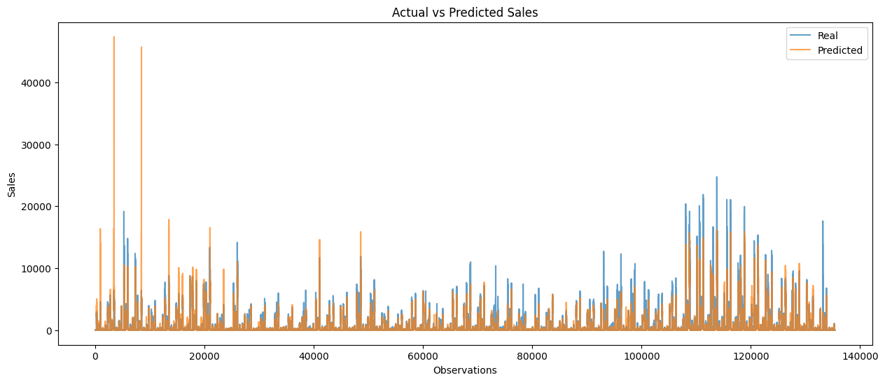
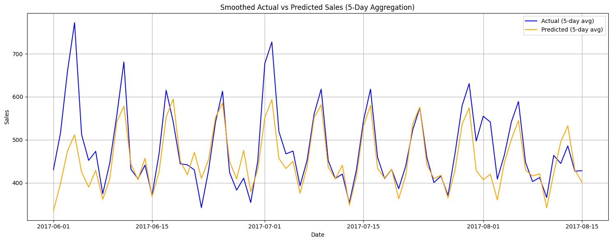

[Git repo](https://github.com/anpac20/sales_predictive_analysis)

## 1. Business hypothesis  
In this project, I simulated a real-world retail forecasting environment using sales data from Favorita stores in Ecuador to understand how different data signals contribute to operational and commercial decision-making.

Product & Business Hypotheses

- Can historical demand patterns significantly improve forecast accuracy compared to using only external and store-level signals?
- How much business value do macroeconomic indicators like oil prices add to retail forecasting?
- Can this model realistically support medium-term operational planning such as stock allocation, promotions, and logistics?

---

## 2. Results and recommendations  

**1. Historical demand is the strongest driver of forecast accuracy**

Without lag features, the model reached an RMSE of 446.94. After introducing 1-day and 7-day lagged sales features, the error dropped to approximately 200. This confirms that short-term demand memory is critical for operational decision-making in this scenario.

**2. Smoothed macroeconomic signals improve model stability** 

Using 7-day and 30-day moving averages of oil prices improved prediction stability compared to using raw daily oil values.
Use oil price trends to adjust how aggressive promotions should be: when the 30-day oil average is going up, lean more on promotions for essential products to protect volume; when it’s flat or going down, pull back on heavy discounts to protect margin.

**3. Model is reliable for medium-term planning, not day-level precision** 

Daily fluctuations remain noisy, but smoothed predictions track real trends accurately.
Use the forecast for weekly planning, not daily decisions: rely on the smoothed predictions to plan weekly stock levels, promotion calendars, and regional allocation, but avoid using the model for hour-by-hour replenishment since daily noise is still too high.

---

## 3. Data  
The dataset comes from a Kaggle competition and contains daily sales across stores and product families. Additional data includes store metadata and oil prices, all of which are used to simulate the external and internal variables a business may have access to.

The main files used are:

- `train.csv`: Daily sales per store and product family
- `stores.csv`: Store metadata (type, cluster, city, state)
- `oil.csv`: Daily oil prices (proxy for economic conditions)

Dates range from 2013 to 2017. Forecasting was done using data up to mid-2017 for training, with the final months reserved for validation.

---

## 4. Feature Engineering  
I enriched the dataset with multiple feature types:

- **Temporal**: day of week, month, weekend flag  
- **Categorical**: encoded store location and type  
- **Macroeconomic**: daily oil price, 7- and 30-day rolling averages  
- **Lag features**: sales per store-family lagged by 1 and 7 days

This structured approach allowed the model to learn from past patterns while incorporating context from store and market conditions.

---

## 5. Model and Training  
A Random Forest Regressor was trained using scikit-learn with 20 estimators. The model was evaluated with and without lag features using RMSE as the metric.

Split strategy:

- **Train set:** dates before June 2017  
- **Validation set:** dates from June 2017 onward

This simulates a realistic time-based validation used in production forecasting environments.

---

## 6. Visual Evaluation  

The high volume of daily sales data makes raw prediction plots difficult to interpret due to noise and extreme spikes. To address this, I applied a two-step smoothing strategy:

Daily sales prediction vs. actual values, smoothed with a daily rolling average to visualize trends over time:

This view confirms that the model captures the overall dynamics of sales behavior and offers an interpretable way to communicate accuracy to business stakeholders.
